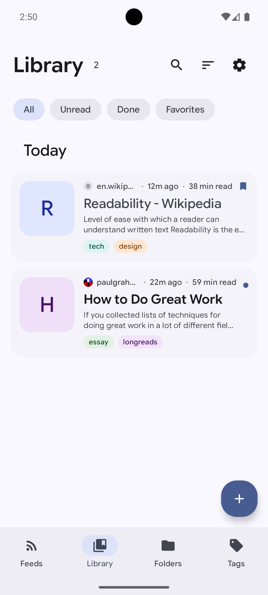
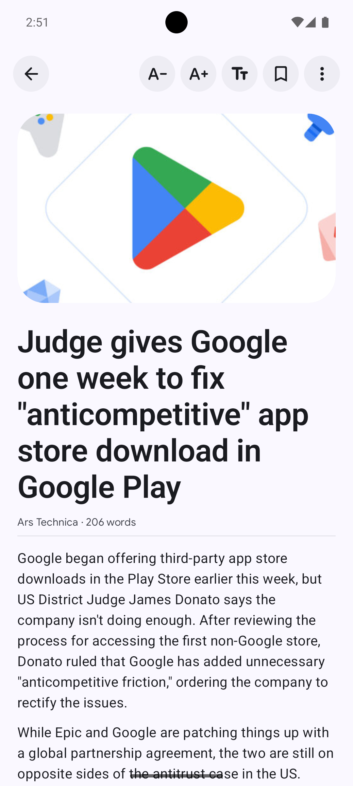
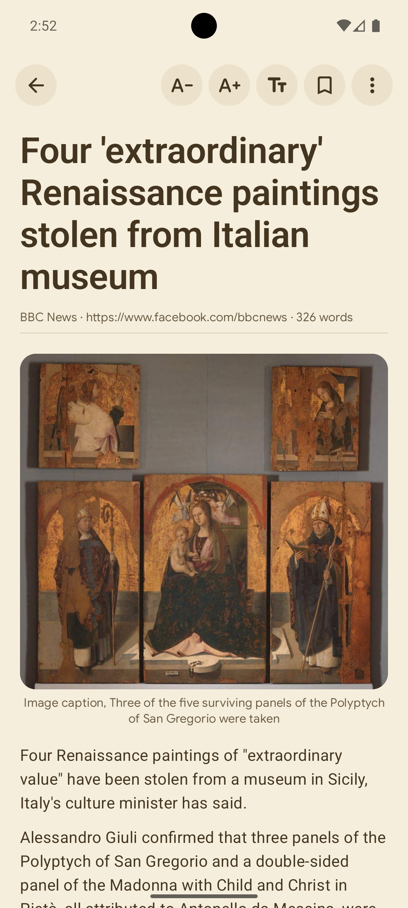
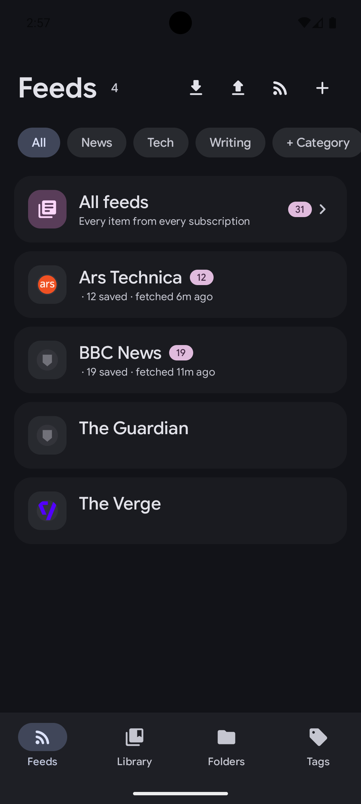
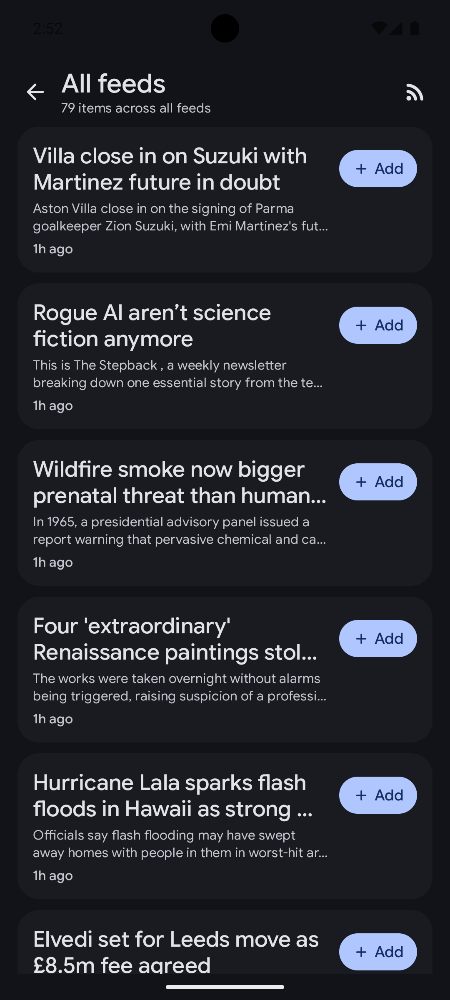
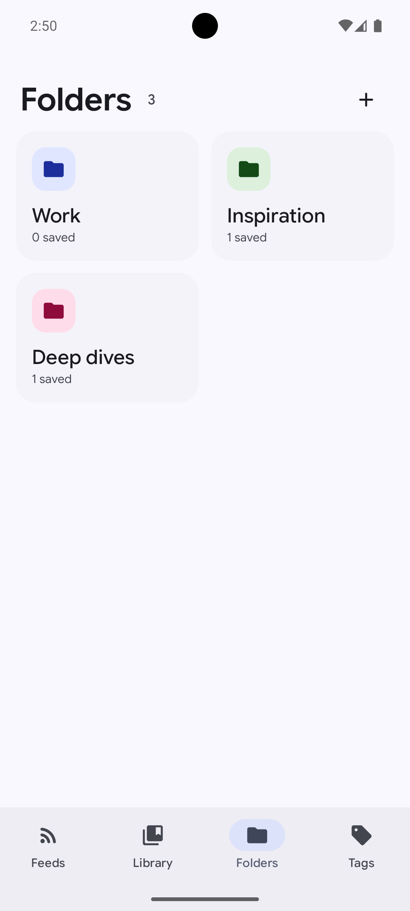

# Pouch

A privacy-first read-later app for Android with a built-in RSS reader, using Material Design 3 Expressive. Alternative to Pocket (RIP).

Save articles and read them in a clean reader mode, organize them with folders and colorful tags, subscribe to RSS/Atom feeds, and keep everything available offline.

## Features

- **Reader mode** — readability-based article extraction (readability4j, a Mozilla Readability port), with fallback scoring heuristics and RSS-feed content fallback for JS-only pages
- **Library** — saved articles with folders, tags, favorites, unread/done filters, full-text search (FTS5), swipe actions (favorite / delete with undo)
- **Highlights** — long-press a paragraph to highlight it in one of four theme-contrast colors
- **Offline** — articles and their images can be downloaded for reading without a connection
- **RSS reader** — subscribe by feed URL or website URL (feed auto-discovery), categories, per-feed unread counts, combined "All feeds" view, OPML import/export
- **Background sync** — WorkManager-based: refresh interval, sync on start, Wi-Fi-only and charging-only constraints; OPML imports and refreshes continue when the app is backgrounded
- **Reading settings** — typeface (Sans / Serif / OpenDyslexic / Mono), text alignment (left / justified / center), text size, line/letter/word spacing
- **Themes** — light / dark / sepia, true OLED, dynamic color (Material You), 5-tone HCT palettes built from the official Material Color Utilities
- **Backup** — export/import your entire library (articles, folders, tags, feeds) as JSON
- **Share integration** — share any link to Pouch to save it; deep links supported

## Screenshots

| Library | Reader (light) | Sepia reader |
| --- | --- | --- |
|  |  |  |

| Feeds | Feed browse (dark) | Folders |
| --- | --- | --- |
|  |  |  |

## Building

```bash
./gradlew :app:assembleDebug
```

The APK lands in `app/build/outputs/apk/debug/app-debug.apk`.
Requires Android SDK with platform 37 and JDK 17+.

## License

GNU General Public License v3.0 — see [LICENSE](LICENSE).

Bundled third-party components retain their own licenses: ROME, readability4j,
jsoup, OkHttp, Coil, material-color-utilities (Apache-2.0), Google Sans Flex and
OpenDyslexic fonts (OFL-1.1). The M3 Expressive shape and motion tokens follow
the Material Design guidelines.
